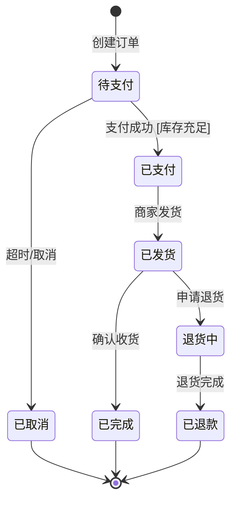

# 业务分析方法规则 V1.0

定义 5 种结构化分析方法，供 Draft 和 Extract 模式共用。对应产出文档中的全局章节。

---

## 方法一：泳道角色法

### 适用场景

多角色协作的流程（用户+运营+系统、前端+后端+数据库）。

### 输出格式

角色 × 阶段矩阵表，每行一个阶段，每列一个角色/系统：

```markdown
| 阶段 | 用户（小程序端） | 前端 | 后端服务 | 数据库 |
|------|------------------|------|----------|--------|
| 浏览商品 | 查看商品列表 | 请求商品列表API | 查询商品表 | 返回商品数据 |
| 加入购物车 | 点击"加入购物车" | 调用加购API | 写入购物车表 | 返回成功 |
| 提交订单 | 点击"结算" | 调用下单API | 创建订单记录 | 返回订单号 |
```

### 分析步骤

1. **识别角色**：列出所有参与方（用户、运营、前端、后端、数据库、第三方服务）
2. **按时间顺序列阶段**：按用户操作路径，从入口到出口排列
3. **填充每个单元格**：描述该角色在该阶段做了什么
4. **检查遗漏**：
   - 操作后是否有反馈？（空白单元格 = 潜在遗漏）
   - 异常是否有提示？（失败路径是否覆盖）
   - 角色之间的数据传递是否完整？

### 关键提问

- 区分"用户做了什么"和"系统判断了什么"
- 这个阶段，哪个角色是主动方？哪个是被动响应方？
- 如果某一列全部为空，是否意味着该角色不参与？还是分析遗漏？

### 暴露遗漏的模式

| 遗漏类型 | 特征 | 检查方式 |
|----------|------|----------|
| 操作无反馈 | 用户操作后对应的前端列为空 | 每个用户操作必须有前端响应 |
| 异常无提示 | 正常路径有值，异常路径为空 | 每个后端操作必须有失败处理 |
| 数据断链 | 前端有操作但数据库列无对应写入 | 追踪数据是否持久化 |
| 角色缺失 | 某一列全部为空 | 确认该角色是否真的不参与 |

---

## 方法二：状态机法

### 适用场景

订单、审批、任务等有明显状态流转的模块。当实体有 ≥ 3 个状态时必须使用。

### 输出格式

**状态流转表：**

```markdown
| 当前状态 | 触发条件（事件） | 守卫条件 | 动作 | 目标状态 |
|----------|------------------|----------|------|----------|
| 待支付 | 用户支付成功 | 库存充足 | 扣减库存、生成订单号 | 已支付 |
| 待支付 | 支付超时（30min） | — | 释放库存预扣 | 已取消 |
| 已支付 | 商家发货 | — | 更新物流单号 | 已发货 |
```

**状态机图（Mermaid）：**



### 分析步骤

1. **列出所有状态**：枚举实体的全部可能状态（含初始和终态）
2. **画状态间可跳转的路径**：每个状态可以跳到哪些状态
3. **标注每个跳转的触发条件**：什么事件触发了状态变化
4. **标注守卫条件**：触发条件满足后，还需要什么额外条件才能跳转
5. **标注动作**：状态跳转时系统执行什么操作

### 关键提问

- "这个状态下，用户能做什么？不能做什么？"
- "这个状态下，系统会自动做什么？"（定时任务、超时处理）
- "是否存在不可逆的状态？从该状态能否回退？"
- "是否有并发的状态变更？两个人同时操作怎么办？"

### 状态机完整度检查

| 检查项 | 说明 |
|--------|------|
| 每个状态都有入口 | 不存在永远无法到达的状态 |
| 每个状态都有出口（终态除外） | 不存在无法离开的中间状态 |
| 终态已标注 | 明确哪些状态是最终状态 |
| 超时/异常路径已覆盖 | 每个等待状态都有超时处理 |
| 回退路径已定义 | 哪些状态可以回退，回退到哪个状态 |

---

## 方法三：数据溯源三问

### 适用场景

每个页面的关键字段，逐字段追问三个维度。

### 三问框架

| 问题 | 含义 | 来源分类 |
|------|------|----------|
| **从哪来** | 这个字段的值从何产生 | 用户输入 / 接口返回 / 本地下拉 / 前端计算 / 上一页传入 / 系统生成 |
| **往哪去** | 这个字段的值提交到哪里 | 提交到哪个API / 写入哪张表 / 触发哪个流程 / 仅展示不提交 |
| **变了怎么办** | 来源数据变更时如何处理 | 实时同步 / 手动刷新 / 不影响已提交数据 / 触发通知 |

### 输出格式

```markdown
| 字段 | 从哪来 | 往哪去 | 变了怎么办 |
|------|--------|--------|------------|
| 商品价格 | 后台商品管理 — SKU价格字段 | 提交订单API — 用于金额计算 | 后台改价 → 前端实时刷新（接口重新拉取） |
| 收货地址 | 用户操作 — 地址选择弹窗 | 提交订单API — 写入订单表 | 编辑地址 → 未提交订单同步更新 |
| 合计金额 | 前端实时计算 — 数量×单价 | 仅展示，不单独提交 | 单价或数量变化 → 自动重算 |
| 订单号 | 系统生成 — 后端生成规则 | 不提交，系统产出 | 不可变 |
| 商品上下架状态 | 后台商品管理 — 实时查询 | 校验逻辑 — 下架商品不可加购 | 下架 → 列表移除或标记不可购 |
```

### 分析步骤

1. **识别页面所有字段**：从页面源码或设计方案中列出全部字段
2. **逐字段回答三问**：每个字段回答"从哪来""往哪去""变了怎么办"
3. **标注不确定项**：来源不明的标注 `[待确认]`，附建议答案
4. **检查数据断链**：如果有字段"往哪去"为空，确认是否仅展示字段

### 草案版标注

- 不确定的来源：`[待确认]`（建议：{具体来源}）
- 不确定的目的地：`[待确认]`（建议：{具体API/表}）
- 不确定的变更策略：`[待确认]`（建议：{同步策略}）

---

## 方法四：单据流转图

### 适用场景

以核心实体（订单、商品、用户、工单等）为单位，描述其完整的生命周期。

### 输出格式

**实体生命周期表：**

```markdown
### 订单生命周期

创建 → 提交 → 支付 → 发货 → 收货 → 完成
                                            ↘ 退货 → 退款

| 阶段 | 参与字段 | 系统响应 | 前置条件 |
|------|----------|----------|----------|
| 创建 | SKU列表、数量、用户ID | 生成购物车记录，预扣库存 | 用户已登录，SKU可售 |
| 提交 | 收货地址、支付方式、优惠券 | 校验库存+优惠券，生成订单号 | 购物车非空，地址已填 |
| 支付 | 支付金额、支付流水号 | 扣减库存，更新订单状态 | 订单未超时 |
| 发货 | 物流公司、物流单号 | 更新物流信息，触发通知 | 支付成功 |
| 收货 | — | 更新订单状态，触发评价提醒 | 已发货，超时自动确认 |
| 退货 | 退货原因、凭证图片 | 创建售后单，退款流程 | 订单已完成（7天内） |
```

### 分析步骤

1. **识别核心实体**：确定文档范围内涉及的核心业务实体
2. **画出生命周期阶段**：从创建到终态，标注分支路径
3. **标注每阶段的参与字段**：哪些字段在此阶段被读取或写入
4. **标注系统响应**：每个阶段后端执行什么操作
5. **标注前置条件**：进入每个阶段需要满足什么条件

### 关键提问

- "这个实体的创建触发条件是什么？"
- "这个实体在什么条件下会被作废/删除？"
- "多个实体之间有关联吗？（订单→商品→库存）"

---

## 方法五：系统交互时序

### 适用场景

跨系统的请求链路，需要明确同步/异步、失败策略、补偿机制。

### 输出格式

```markdown
| # | 触发操作 | 请求链路 | 同步/异步 | 失败策略 |
|---|----------|----------|-----------|----------|
| 1 | 提交订单 | 小程序 → API网关 → 订单服务 → DB（写入） → 库存服务 → DB（扣减） | 同步 | 事务回滚 + Toast提示"下单失败" |
| 2 | 支付回调 | 支付网关 → 订单服务 → DB（更新状态） → 通知服务 → 消息队列 | 异步 | 重试3次 + 告警 + 人工对账 |
| 3 | 发货通知 | 后台运营 → 订单服务 → DB（更新物流） → 消息推送服务 → 微信模板消息 | 异步 | 重试3次 + 记录失败日志 |
| 4 | 库存同步 | 定时任务 → 库存服务 → ERP系统 | 异步 | 补偿对账 + 差异告警 |
```

### 分析步骤

1. **列出所有跨系统操作**：涉及前端、API网关、微服务、数据库、第三方、消息队列的交互
2. **画出请求→响应链路**：从触发源到最终响应的完整路径
3. **标注同步/异步**：
   - 同步：用户等待响应（提交、查询、支付）
   - 异步：后台处理（回调、通知、定时任务）
4. **定义失败策略**：
   - 用户侧：Toast/弹窗提示 + 允许重试
   - 系统侧：自动重试 + 告警 + 人工补偿

### 关键标注

| 标注项 | 说明 |
|--------|------|
| 同步/异步 | 决定是否需要重试和补偿机制 |
| 超时时间 | 同步请求的最大等待时间 |
| 重试次数 | 异步操作的最大重试次数 |
| 幂等性 | 同一请求重复执行是否产生相同结果 |
| 补偿机制 | 最终一致性的兜底方案（对账、告警、人工） |

---

## 方法选择指南

| 场景特征 | 推荐方法 | 优先级 |
|----------|----------|--------|
| 有多种角色参与 | 泳道角色法 | ★★★ 必做 |
| 有状态流转的实体 | 状态机法 | ★★★ 必做 |
| 有关键字段需要追踪 | 数据溯源三问 | ★★★ 必做 |
| 有核心业务实体 | 单据流转图 | ★★☆ 推荐 |
| 涉及多个系统交互 | 系统交互时序 | ★★☆ 推荐 |
| 单页纯展示无交互 | 仅十字法用例表即可 | ★☆☆ 可选 |

---

## Anti-patterns

| 反模式 | 正确做法 |
|--------|----------|
| 跳过泳道直接写用例 | 先理清角色职责，再展开用例 |
| 状态机只画正常路径 | 每个状态必须覆盖异常和超时路径 |
| 数据溯源只填"从哪来" | 三问缺一不可，尤其是"变了怎么办" |
| 单据流转忽略作废/删除路径 | 每个实体必须有终态处理 |
| 系统时序不标注同步/异步 | 每条链路必须标注，决定失败策略 |
| 边界条件只写"需处理" | 必须写明具体处理策略（重试次数、补偿方式） |
