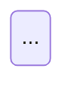
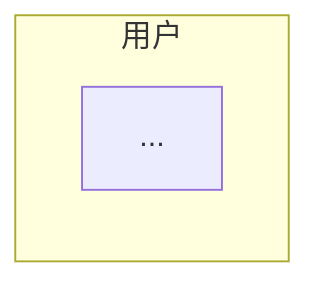
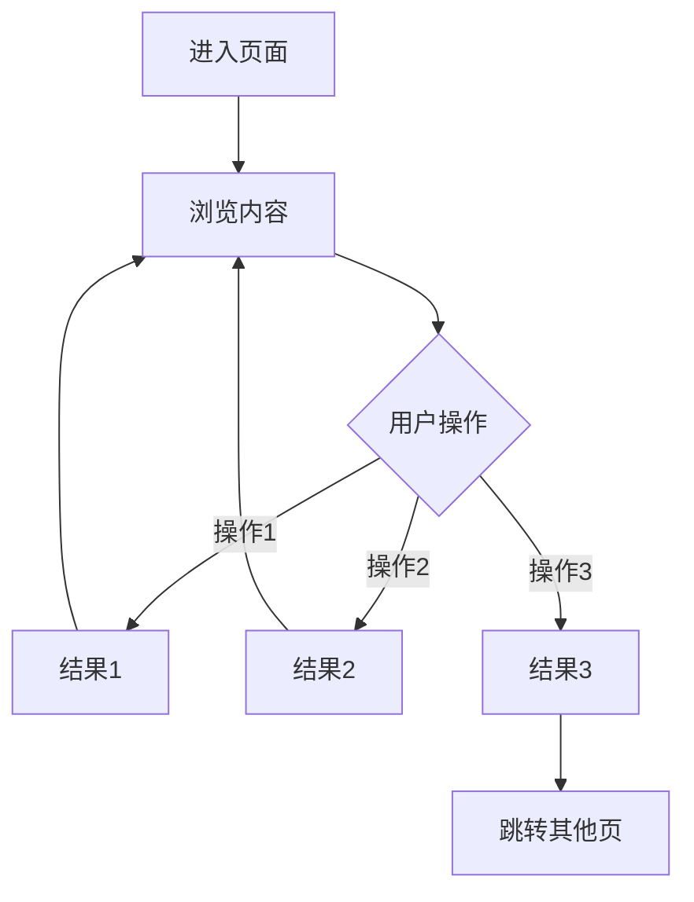
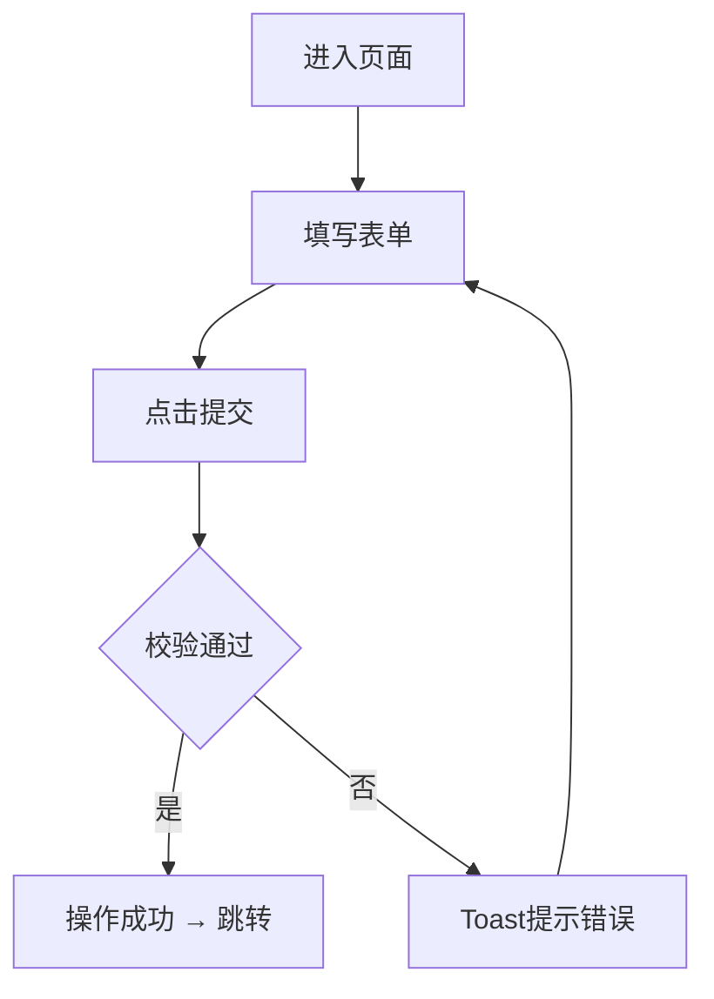
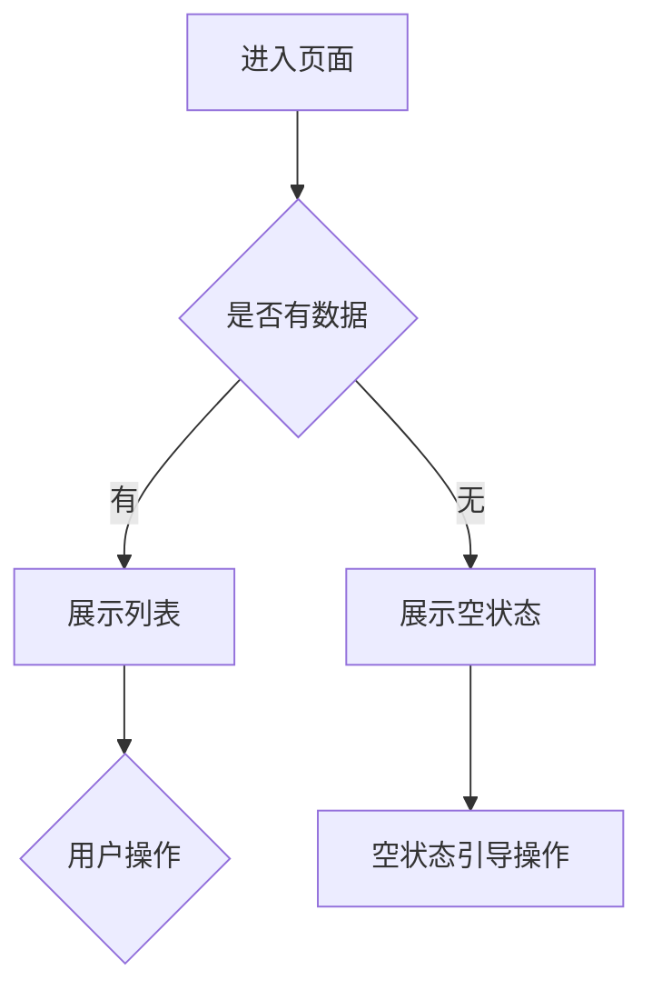
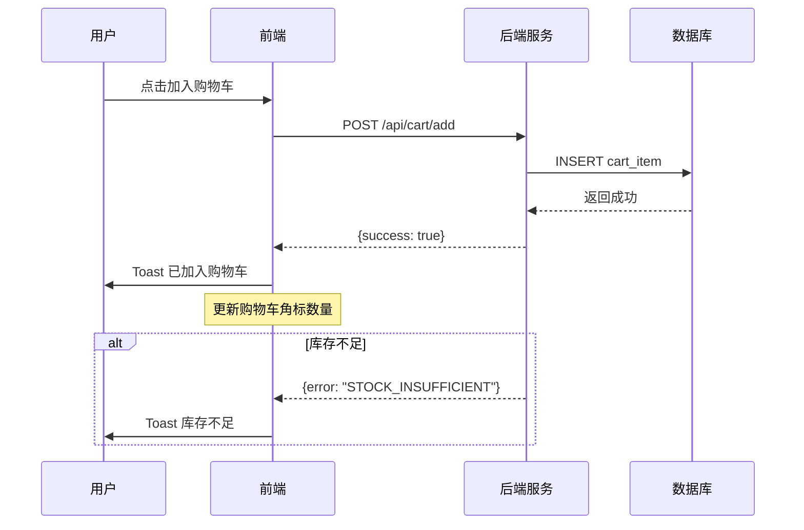
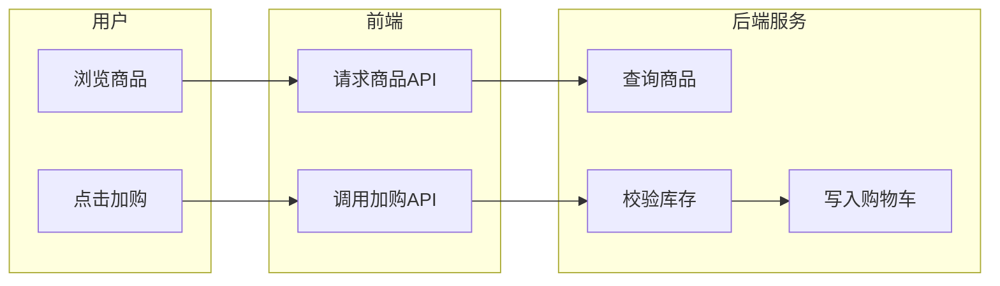
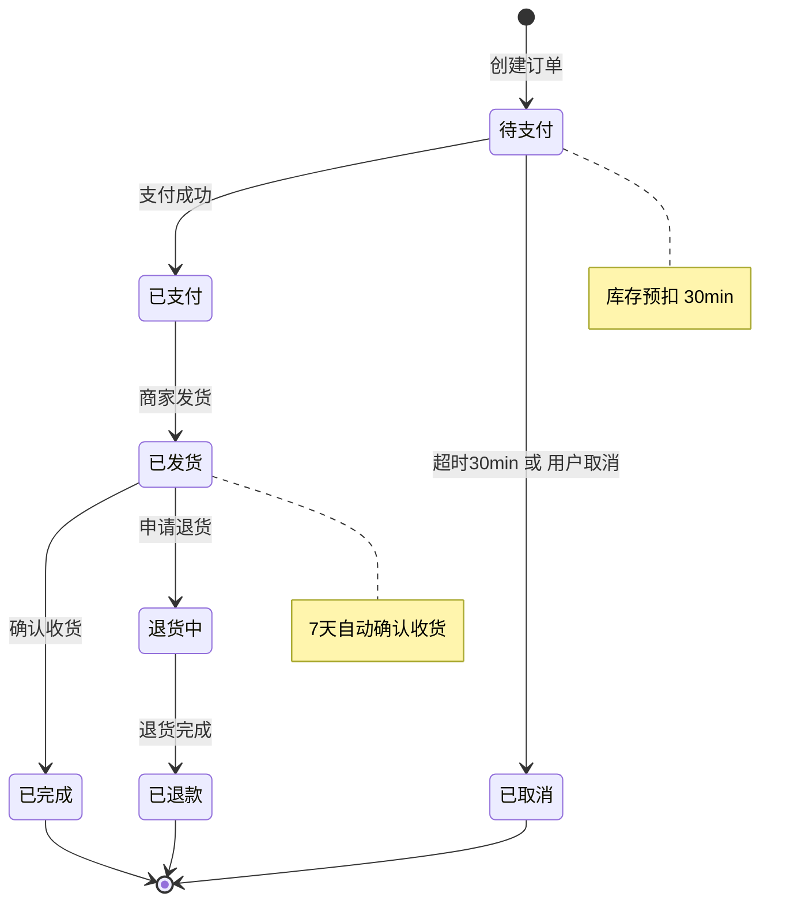
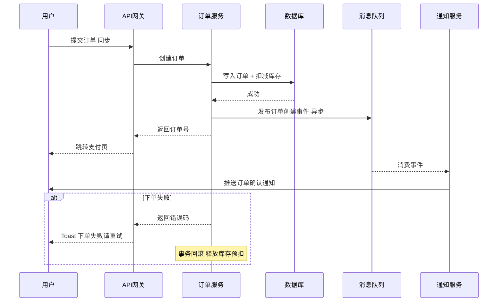

# 流程图规则 V0.53

## 基本原则

1. **有流程才画图** — 页面有明确的用户操作路径时必须画流程图；纯展示页（如静态图文页）可省略
2. **按需补充** — 以下场景必须补充流程图：
   - 有分支判断的操作（如登录校验、绑定冲突检测）
   - 多步骤流程（如注册流程、手机号修改步骤）
   - 有状态切换的交互（如浏览/编辑模式切换）
   - 复杂业务逻辑的文字描述难以直观理解时
3. **一个页面一张图** — 每个页面章节最多一张主流程图，不要拆成多张
4. **节点用中文** — 所有节点标签使用中文，与技术术语保持一致

---

## 渲染方案优先级

按以下顺序尝试渲染，首方案成功即停止：

| 优先级 | 方案 | 说明 | 适用条件 |
|--------|------|------|----------|
| 1 | **`/diagram-design` 技能** | 调用 diagram-design 技能生成独立 HTML 文件（内联 SVG + CSS），编辑级视觉质量 | 技能已安装（目录 `~/.claude/skills/diagram-design/` 存在且含 SKILL.md） |
| 2 | **Mermaid 代码块** | 嵌入 mermaid flowchart 代码块，按 V5.0 方案渲染为 SVG | diagram-design 不可用时 |

### 方案1：`/diagram-design`（首选）

调用 `/diagram-design` 技能生成流程图，输出为独立 `.html` 文件。

**调用时机：** 阶段三"渲染与输出"中，流程图渲染步骤。

**调用方式：** 使用 `Skill` 工具调用 `/diagram-design`，参数说明：

| 参数 | 值 |
|------|-----|
| diagram type | flowchart |
| 输入 | 本规则定义的流程结构（见下方"流程结构模式"），按 diagram-design 的 `references/type-flowchart.md` 规范转换 |
| 输出路径 | `doc/V{版本}/diagrams/` 目录，文件命名 `{页面名}_flow.html` |

**diagram-design 节点映射：**

| 本规则节点类型 | diagram-design 形状 | 说明 |
|----------------|---------------------|------|
| 起止节点 `A[进入页面]` | Oval (`rx=20`) | 开始/结束 |
| 操作节点 `C[填写表单]` | Rectangle (`rx=6`) | 步骤/动作 |
| 判断节点 `B{校验通过}` | Diamond | 决策分支（≤3个出口） |
| 跳转/结果节点 `F(跳转首页)` | Oval (`rx=20`) | 终止/跳转 |
| 合并回环 | Small filled ink dot (`r=4`) | 分支汇合点 |

**样式要点：**
- Coral（accent）仅用于 happy path 或最关键的决策节点，≤2个节点
- 形状传递类型信息，不用填充色区分节点类型
- 决策菱形 ≤3 个出口，超过则拆分为嵌套菱形
- 所有分支必须标注标签

---

#### diagram-design 调度：状态机图（diagram type: state）

**适用条件：** 模式五（状态机图），实体有 ≥ 3 个状态时调用。

| 参数 | 值 |
|------|-----|
| diagram type | state |
| 输入 | 状态机法输出的状态列表 + 跳转路径 + 触发条件，按 `references/type-state.md` 规范转换 |
| 输出路径 | `doc/V{版本}/diagrams/{实体名}_state.html` |

**节点映射：**

| 本规则状态机元素 | diagram-design 元素 | 说明 |
|-------------------|---------------------|------|
| 初始状态 `[*]` | Small filled dot (`r=6`) | 状态机入口 |
| 状态节点 `待支付` | Rounded rectangle (`rx=12`) | 中间状态 |
| 终态 `[*]` | Double circle or filled dot with ring | 状态机出口 |
| 转移 `支付成功` | Curved arrow with label | `event [guard] / action` |
| 超时转移 | Dashed arrow | 虚线表示自动触发 |

**样式要点：**
- 状态节点使用统一的圆角矩形，不区分颜色
- 转移标签格式：`事件 [守卫条件]`（如 `支付成功 [库存充足]`）
- 超时/自动触发用虚线箭头区分
- 正向路径（happy path）箭头加粗

**文档引用格式：**

```markdown


<details>
<summary>Mermaid 源码（备选）</summary>



</details>
```

---

#### diagram-design 调度：时序图（diagram type: sequence）

**适用条件：** 模式六（系统时序图）和模式四（泳道角色图方式一），涉及跨系统交互时调用。

| 参数 | 值 |
|------|-----|
| diagram type | sequence |
| 输入 | 系统交互时序表或泳道角色图，按 `references/type-sequence.md` 规范转换 |
| 输出路径 | `doc/V{版本}/diagrams/{操作名}_seq.html` |

**节点映射：**

| 本规则时序元素 | diagram-design 元素 | 说明 |
|-------------------|---------------------|------|
| 参与者 `用户` | Actor box | 交互角色/系统 |
| 生命线 | Dashed vertical line | 参与者存活周期 |
| 同步消息 `→` | Solid arrow with label | 请求/调用 |
| 返回消息 `-->>` | Dashed arrow with label | 响应/返回 |
| 自关联消息 | Loop-back arrow | 自身调用 |
| alt 块（异常） | Rectangular frame with label | 条件分支区域 |
| Note 标注 | Note box | 补充说明 |

**样式要点：**
- 同步消息用实线箭头，异步消息用虚线箭头
- alt 块（异常分支）用浅色背景区分
- 关键策略标注（重试、超时）用 Note 补充
- 参与者从左到右按调用链排列

**文档引用格式：**

```markdown


<details>
<summary>Mermaid 源码（备选）</summary>

```mermaid
sequenceDiagram
    ...
```

</details>
```

---

#### diagram-design 调度：泳道图（diagram type: swimlane）

**适用条件：** 模式四（泳道角色图方式二），多角色协作流程时调用。当角色交互以消息传递为主时优先使用 sequence 类型，以流程步骤为主时使用 swimlane 类型。

| 参数 | 值 |
|------|-----|
| diagram type | swimlane |
| 输入 | 角色泳道图矩阵表，按 `references/type-swimlane.md` 规范转换 |
| 输出路径 | `doc/V{版本}/diagrams/{流程名}_swimlane.html` |

**节点映射：**

| 本规则泳道元素 | diagram-design 元素 | 说明 |
|-------------------|---------------------|------|
| 角色行（用户/前端/后端） | Horizontal lane with label | 泳道行 |
| 流程步骤 | Rounded rectangle in lane | 具体操作 |
| 跨泳道转移 | Arrow crossing lane boundary | 数据/控制传递 |
| 判断节点 | Diamond in lane | 条件分支 |
| 起止节点 | Oval in lane | 开始/结束 |

**样式要点：**
- 泳道标签使用中文简短名
- 跨泳道箭头标注传递的数据/信息
- 同步操作用实线，异步操作用虚线
- 异常路径用浅色箭头

**文档引用格式：**

```markdown


<details>
<summary>Mermaid 源码（备选）</summary>



</details>
```

---

```markdown


<details>
<summary>Mermaid 源码（备选）</summary>


</details>
```

**关键：** 即使使用 diagram-design 生成 HTML，仍需在 `<details>` 中保留 Mermaid 源码作为文本可读备份。

### 方案2：Mermaid 代码块（备选）

当 diagram-design 技能不可用时（目录不存在或 SKILL.md 缺失），回退到 Mermaid 方案。

**回退时必须提示用户：**

> 当前流程图使用 Mermaid 渲染。安装 diagram-design 技能可获得更高质量的 HTML 流程图（内联 SVG + CSS）。安装方式：将技能克隆到 `~/.claude/skills/diagram-design/` 目录即可。仓库地址：`https://github.com/cathrynlavery/diagram-design`

提示在首次回退时输出一次，同一会话内不重复提示。

#### Mermaid 语法规范

**使用 flowchart，不用 graph**

```
✅ flowchart TD
❌ graph TD
```

**方向选择**

| 方向 | 适用场景 |
|------|----------|
| TD（从上到下） | 默认方向，适用于绝大多数页面流程 |
| LR（从左到右） | 仅用于线性步骤流程（如注册步骤条） |

**节点类型**

| 节点形状 | Mermaid语法 | 含义 | 示例 |
|----------|------------|------|------|
| 矩形 `[]` | `A[进入登录页]` | 起止节点 / 操作节点 | "进入购物车页"、"展示地址列表" |
| 菱形 `{}` | `B{用户选择}` | 判断/分支节点 | "校验通过？"、"购物车是否有商品？" |
| 圆角 `()` | `F(跳转首页)` | 最终结果/跳转节点 | "跳转首页"、"Toast提示错误" |

**连线标签**

- 分支连线必须标注条件，使用 `-->|条件|` 语法
- 标签用简短中文，不超过10个字

```
E -->|是| F[登录成功 → 跳转首页]
E -->|否| G[Toast提示错误]
```

#### Mermaid → SVG 渲染（备选方案内）

| 优先级 | 方案 | 命令 | 适用条件 |
|--------|------|------|----------|
| 1 | **mmdc 本地渲染** | `mmdc -i input.mmd -o output.svg --theme default --backgroundColor white` | 本机已安装 mmdc |
| 2 | **kroki.io POST API** | `curl -X POST ... https://kroki.io/flowchart/svg` | 有网络，流程图 ≤ 100行 |
| 3 | **mermaid.ink GET API** | `https://mermaid.ink/svg/base64_encoded_content` | 有网络，流程图 ≤ 80行且无中文 |
| 4 | **留待后续生成** | 保存 `.mmd` 源文件，文档中引用空占位 | 所有方案失败 |

#### 文档引用格式（Mermaid 备选）

```markdown


<details>
<summary>Mermaid 源码</summary>


</details>
```

---

## 节点命名规范

### 起始节点

固定格式：`A[进入{页面名称}]`

```
A[进入购物车页]
A[进入确认订单页]
```

### 判断节点

使用 `{}` 菱形，问句结尾：

```
B{购物车是否有商品}
E{校验通过}
C{用户操作}
```

其中"用户操作"类判断节点用于列举页面的多个并行操作入口：

```
C -->|点击搜索框| D[跳转搜索页]
C -->|滑动Banner| E[轮播切换]
C -->|点击商品| F[跳转商品详情]
```

### 操作节点

- 用方括号 `[]`，描述具体动作
- 多个连续动作用 `→` 连接，不用多个节点

```
✅ C[输入手机号 → 获取验证码]
❌ C[输入手机号] --> D[获取验证码]
```

### 跳转/结果节点

- 跳转到其他页面用 `→` 格式：`F[登录成功 → 跳转首页]`
- Toast提示：`G[Toast 已加入购物车]`
- 留在当前页：`J[留在登录页]`

### 回环节节

操作完成后回到浏览状态，用一个通用节点收束：

```
D --> B   %% 回到浏览状态
G --> C   %% 回到用户选择
```

---

## 流程结构模式

### 模式一：浏览-操作循环

适用于信息展示+多入口的页面（首页、商品详情、购物车等）。



### 模式二：表单提交流程

适用于有明确填写→校验→提交路径的页面（登录、注册、新增地址等）。



### 模式三：条件分支流程

适用于有空状态/有状态区分的页面（购物车、订单列表等）。



### 模式四：泳道角色图

适用于多角色协作流程，展示角色间的交互关系。使用 `sequenceDiagram` 或 `flowchart LR` + `subgraph`。

**方式一：sequenceDiagram（推荐）**



**方式二：flowchart LR + subgraph（备选）**



**命名规范：**
- participant 使用简短中文：用户、前端、后端服务、数据库、第三方服务
- 消息文本使用动词开头
- `alt` 块用于异常分支

### 模式五：状态机图

适用于有状态流转的实体（订单、审批、工单等），使用 `stateDiagram-v2`。



**命名规范：**
- 状态名使用简短中文：待支付、已支付、已发货、已完成、已取消
- 转移标签描述触发条件
- `[*]` 标记初始状态和终态
- `note` 标注关键约束（超时时间、自动触发规则）

### 模式六：系统时序图

适用于跨系统的请求链路，展示同步/异步和失败策略。使用 `sequenceDiagram`。



**标注规范：**
- 消息标签后标注 `同步` 或 `异步`
- `alt` 块展示失败路径和补偿机制
- `Note` 标注关键策略（事务回滚、重试次数、超时时间）

---

## 文字补充规则

流程图后用1-3句话补充以下信息（不要逐节点复述流程图）：

1. **阈值/数值** — 如"滑动距离超过40px触发切换"
2. **时序细节** — 如"验证码按钮60秒倒计时"
3. **互斥逻辑** — 如"同一时刻只允许一个商品处于展开状态"
4. **动画效果** — 如"删除动画0.2s高度收缩+透明度淡出"

不需要补充的内容（流程图已表达清楚）：
- 节点之间的先后顺序
- 简单的点击跳转关系
- 判断的yes/no分支

---

## 禁止使用的字符（Mermaid 备选方案）

Mermaid 解析器会将以下字符视为语法标记，**在节点标签和连线标签中禁止使用**：

| 禁止字符 | 原因 | 替代方案 |
|----------|------|----------|
| `""` 中文引号 | 被解析为字符串分隔符，导致 Parse error | 去掉引号，用空格分隔；或使用「」 |
| `""` 英文引号 | 同上 | 同上 |
| `()` | 用于圆角节点语法 | 节点文本中避免使用，或用 `（）` 全角括号 |
| `{}` | 用于菱形节点语法 | 节点文本中避免使用 |
| `[]` | 用于矩形节点语法 | 节点文本中避免使用 |
| `>` | 用于连线箭头语法 | 用文字"跳转"代替 |

### 典型错误示例

```
❌ I -->|拒绝/关闭遮罩| J[Toast"已拒绝授权" → 留在登录页]
```
报错：`Expecting 'SQE', got 'STR'`，因为 `""` 被解析器当作字符串分隔符。

```
✅ I -->|拒绝/关闭遮罩| J[Toast 已拒绝授权 → 留在登录页]
```

### 正确写法对照

| 场景 | 错误写法 | 正确写法 |
|------|----------|----------|
| Toast 提示文案 | `[Toast"已加入购物车"]` | `[Toast 已加入购物车]` |
| 点击按钮名称 | `-->|点击"立即购买"|` | `-->|点击 立即购买|` |
| Alert 提示文案 | `[Alert"请填写完整信息"]` | `[Alert 请填写完整信息]` |

**原则**：节点标签中用空格代替引号来分隔操作类型和具体文案。引号只出现在流程图外的正文描述中。

---

## 常见错误

| 错误做法 | 正确做法 |
|----------|----------|
| 节点标签使用引号 `""` | 去掉引号，用空格分隔 |
| 每个输入框画一个节点 | 合并为"填写表单"一个节点 |
| 跳转后再画目标页面的流程 | 跳转节点即为终点，不展开目标页面 |
| 判断节点不写条件标签 | 所有分支必须标注 `-->|条件|` |
| 用英文命名节点 | 全部使用中文 |
| 同一页面画多张流程图 | 合并为一张，用分支表达 |
| 流程图后逐句翻译流程图 | 只补充阈值、时序、动画等细节 |
| diagram-design 可用却使用 Mermaid | 优先使用 diagram-design，Mermaid 仅作备选 |
| diagram-design 生成后不保留 Mermaid 源码 | 必须在 `<details>` 中保留 Mermaid 备份 |
| 状态机图遗漏终态 `[*]` | 每个终态必须标注 `→ [*]` |
| 时序图不标注同步/异步 | 每条消息必须标注 |
| 泳道图遗漏异常分支 | 必须用 `alt` 块覆盖失败路径 |
| 状态机图遗漏超时处理 | 每个等待状态都应有超时转移 |
