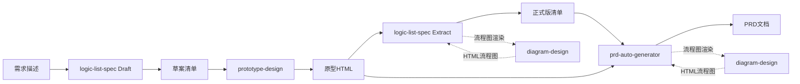

# 产品规格技能链协作指南 V0.22

定义产品文档技能链的协作方式和输入输出关系。

---

## 技能链概览

**目的：** 实现从需求到PRD的自动化文档流程，降低编写成本，确保一致性。

**核心技能：**

| 序号 | 技能名称 | 作用 |
|------|----------|------|
| 1 | **logic-list-spec** | 业务逻辑清单生成（Draft/Extract双模式，融合十字法和6步分析） |
| 2 | **prototype-design** | 原型HTML生成（口述/草案双模式） |
| 3 | **prd-auto-generator** | PRD文档生成（清单/大纲双模式） |

**辅助技能：**

| 序号 | 技能名称 | 作用 | 调用方 |
|------|----------|------|--------|
| 4 | **diagram-design** | 流程图/架构图等可视化图表生成（独立 HTML + 内联 SVG） | logic-list-spec、prd-auto-generator |
| 5 | **idea-refine** | 需求迭代精炼（HMW、变体生成、压力测试） | logic-list-spec Draft模式 |

---

## 技能链流程

---

## 辅助技能调用规则

### diagram-design 调用

**何时调用：** 当需要生成可视化图表时，优先调用 `/diagram-design`，不可用时回退到 Mermaid。

**调用方与场景：**

| 调用方 | 调用场景 | diagram 类型 | 输出路径 |
|--------|----------|-------------|----------|
| logic-list-spec Extract | 页面操作流程图 | flowchart | `doc/V{版本}/diagrams/` |
| logic-list-spec Extract | 状态流转图 | stateDiagram | `doc/V{版本}/diagrams/` |
| logic-list-spec Extract | 角色交互泳道图 | sequenceDiagram / swimlane | `doc/V{版本}/diagrams/` |
| logic-list-spec Extract | 系统交互时序图 | sequenceDiagram | `doc/V{版本}/diagrams/` |
| prd-auto-generator | 全流程图、校验流程图、状态流转图 | flowchart / stateDiagram | `PRD/diagrams/` |

**回退规则：**

| 条件 | 方案 |
|------|------|
| `~/.claude/skills/diagram-design/` 存在且含 SKILL.md | 调用 `/diagram-design` 生成 HTML |
| 目录不存在或 SKILL.md 缺失 | 回退到 Mermaid 代码块 + SVG 渲染 |

**安装地址：** https://github.com/cathrynlarray/diagram-design

### idea-refine 调用

**何时调用：** logic-list-spec Draft 模式阶段一（需求收集），深度融合 HMW、变体生成、压力测试方法。

---

## 输入输出关系

| 技能 | 输入 | 输出 |
|------|------|------|
| **logic-list-spec Draft** | 需求描述 + codebase扫描 | 业务逻辑清单草案（含HMW、Not Doing、假设清单、6步分析章节） |
| **prototype-design** | 业务逻辑清单草案 / 口述需求 | 原型HTML页面 |
| **logic-list-spec Extract** | 原型HTML源码 | 正式版业务逻辑清单（含可选截图引用 + diagram-design 流程图 + 6步分析章节；截图默认关闭，用户要求时才加） |
| **prd-auto-generator** | 正式版清单 + 原型HTML | PRD文档（含 diagram-design 流程图） |
| **diagram-design** | 流程结构描述 | 独立 HTML 文件（内联 SVG + CSS） |

---

## 技能模式对照

| 技能 | 模式 | 适用场景 |
|------|------|----------|
| logic-list-spec | **Draft** | 无原型，首次设计 |
| logic-list-spec | **Extract** | 有原型，逆向验证 |
| prototype-design | **草案模式** | 有清单草案，精确映射 |
| prototype-design | **口述模式** | 无清单，快速生成 |
| prd-auto-generator | **清单模式** | 有业务逻辑清单（技能链输出） |
| prd-auto-generator | **大纲模式** | 有功能大纲（备用） |

---

## 状态标记流转

| 标记 | Draft阶段 | prototype阶段 | Extract阶段 | PRD阶段 |
|------|-----------|---------------|-------------|---------|
| `[草案]` | 产生 | 正常生成 | 移除 | 不出现 |
| `[待原型]` | 产生 | 生成+标注 | 移除 | 不出现 |
| `[待确认]` | 产生 | 占位符 | 替换结果 | 建议保留 |
| `[必验]` | 产生 | 验证清单 | 标注结果 | 业务规则 |
| `[风险]` | 产生 | 风险提示 | 标注应对 | 业务规则 |

---

## 调用顺序

| 场景 | 调用顺序 |
|------|----------|
| **完整流程** | `/logic-list-spec --mode=draft` → `/prototype-design` → `/logic-list-spec --mode=extract` → `/prd-auto-generator` |
| **快速流程** | `/prototype-design`（口述） → `/logic-list-spec --mode=extract` → `/prd-auto-generator` |
| **逆向流程** | `/logic-list-spec --mode=extract` → `/prd-auto-generator` |

**流程图渲染：** 在 logic-list-spec Extract 和 prd-auto-generator 执行过程中，流程图步骤自动调用 `/diagram-design`（如已安装），否则使用 Mermaid。

---

## 清单内容 → PRD映射

| 清单内容 | PRD章节 |
|----------|---------|
| HMW问题陈述 | 需求背景 |
| 成功标准 | 需求分析（验收指标） |
| 功能用例表（6列） | 交互说明 / 流程图 |
| 关键字段表（4列溯源三问） | 输入项 / 输出项 / 数据流转 |
| 业务逻辑增强 | 业务规则表 |
| 状态流转表 | 状态机设计 |
| 跳转关系表 | 系统流程图 |
| 登录拦截表 | 数据权限设计 |
| 角色泳道图 | 系统架构 / 角色权限 |
| 核心单据流转 | 数据模型设计 |
| 系统交互时序 | 接口设计 |
| 边界条件清单 | 非功能需求 |

---

## 技能仓库地址

| 技能 | GitHub仓库 |
|------|------------|
| logic-list-spec | https://github.com/lyuxiaohei/logic-list-spec |
| prototype-design | https://github.com/lyuxiaohei/prototype-design |
| prd-auto-generator | https://github.com/lyuxiaohei/prd-auto-generator |
| diagram-design | https://github.com/cathrynlarray/diagram-design |
| idea-refine | https://github.com/anthropics/idea-refine |

---

## 版本记录

| 版本 | 日期 | 变更 |
|------|------|------|
| V0.22 | 2026-06-11 | 融合十字法/泳道角色法/状态机法/数据溯源三问/单据流转/系统时序方法论；用例表6列；数据来源4列溯源三问；新增角色泳道图、核心单据流转、系统交互时序、边界条件清单4个全局章节；新增 rules/business-analysis.md |
| V0.21 | 2026-05-21 | 新增 diagram-design 辅助技能，流程图优先使用 diagram-design，Mermaid 作为备选 |
| V0.2 | 2026-04-24 | 简化为3技能 |
| V0.1 | 2026-04-24 | 初版 |
