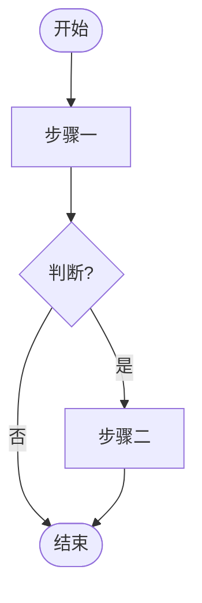
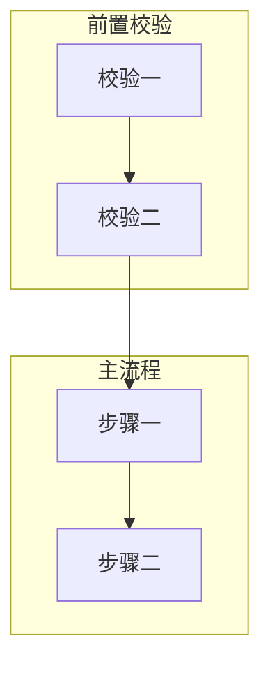
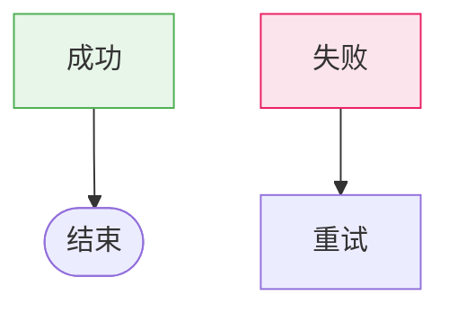
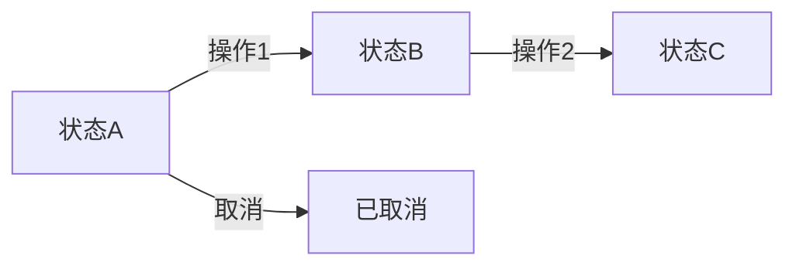
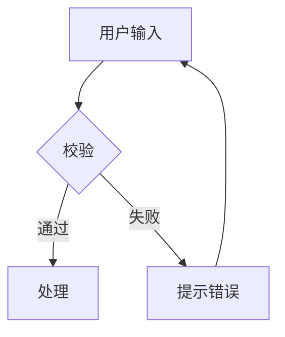
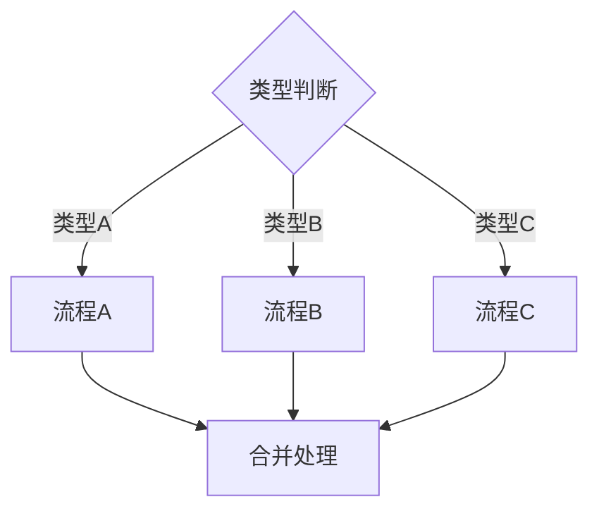

# 流程图生成规则 V0.12

定义如何生成业务流程图，适用于各类业务场景。优先使用 `/diagram-design` 技能生成高质量流程图，不可用时回退到 Mermaid。

---

## 渲染方案优先级

按以下顺序尝试，首方案成功即停止：

| 优先级 | 方案 | 说明 | 适用条件 |
|--------|------|------|----------|
| 1 | **`/diagram-design` 技能** | 调用 diagram-design 技能生成独立 HTML 文件（内联 SVG + CSS），编辑级视觉质量 | 技能已安装（目录 `~/.claude/skills/diagram-design/` 存在且含 SKILL.md） |
| 2 | **Mermaid 代码块** | 嵌入 mermaid flowchart 代码块，渲染为 SVG | diagram-design 不可用时 |

---

## 适用场景

当版本涉及以下内容时，应生成流程图：

| 场景 | 流程图类型 |
|------|-----------|
| 完整业务流程（下单、审批、任务流转） | 全流程图，作为首章概述 |
| 状态机（订单状态、审批状态） | 状态流转图 |
| 复杂页面交互（多步骤表单、弹窗链） | 页面内交互流程图 |
| 跨页面校验逻辑（配送校验、支付校验） | 校验流程子图 |

---

## 方案1：`/diagram-design`（首选）

### 调用方式

使用 `Skill` 工具调用 `/diagram-design`，参数说明：

| 参数 | 值 |
|------|-----|
| diagram type | flowchart（流程图）、state-machine（状态流转图）等，按场景选择 |
| 输入 | 本规则定义的流程结构，按 diagram-design 的 `references/type-flowchart.md` / `references/type-state.md` 规范转换 |
| 输出路径 | `PRD/diagrams/` 目录，文件命名 `{流程名}.html` |

### diagram-design 节点映射

| 本规则节点类型 | diagram-design 形状 | 说明 |
|----------------|---------------------|------|
| 开始/结束 | Oval (`rx=20`) | 起止节点 |
| 普通步骤 | Rectangle (`rx=6`) | 操作/动作节点 |
| 判断/分支 | Diamond | 决策节点（≤3个出口） |
| 子程序/外部流程 | Rectangle (`rx=6`) + type tag | 标注子程序类型 |
| 合并点 | Small filled ink dot (`r=4`) | 分支汇合 |

### 样式要点

- Coral（accent）仅用于 happy path 或最关键的决策节点，≤2个节点
- 形状传递类型信息，不用填充色区分节点类型
- 决策菱形 ≤3 个出口，超过则拆分为嵌套菱形
- 所有分支必须标注标签
- 子图（subgraph）用 diagram-design 的嵌套分组表达

### 颜色约定（与 diagram-design 设计系统对齐）

| 状态 | diagram-design 语义角色 | 说明 |
|------|------------------------|------|
| 成功/完成 | accent + accent-tint | 1-2个焦点节点 |
| 失败/错误 | ink @ 0.05 + muted stroke | 非焦点，低视觉权重 |
| 警告/阻断 | ink @ 0.02 + ink @ 0.20 dashed | 可选/异常流程 |
| 中间态 | white + ink stroke | 普通步骤 |

### 文档引用格式

```markdown


<details>
<summary>Mermaid 源码（备选）</summary>


</details>
```

**关键：** 即使使用 diagram-design 生成 HTML，仍需在 `<details>` 中保留 Mermaid 源码作为文本可读备份。

---

## 方案2：Mermaid 代码块（备选）

当 diagram-design 技能不可用时，回退到 Mermaid 方案。

**回退时必须提示用户：**

> 当前流程图使用 Mermaid 渲染。安装 diagram-design 技能可获得更高质量的 HTML 流程图（内联 SVG + CSS）。安装方式：将技能克隆到 `~/.claude/skills/diagram-design/` 目录即可。仓库地址：`https://github.com/cathrynlavery/diagram-design`

提示在首次回退时输出一次，同一会话内不重复提示。

### 基本语法

使用 `flowchart TB`（从上到下）或 `flowchart LR`（从左到右）：



### 节点类型

| 语法 | 形状 | 适用场景 |
|------|------|----------|
| `([文本])` | 圆角矩形 | 开始/结束节点 |
| `[文本]` | 矩形 | 普通步骤 |
| `{文本}` | 菱形 | 判断/分支 |
| `[[文本]]` | 子程序 | 调用外部流程 |
| `>文本]` | 不对称 | 输入/输出 |

### 连接线类型

| 语法 | 样式 | 适用场景 |
|------|------|----------|
| `-->` | 实线箭头 | 主流程 |
| `--` | 实线无箭头 | 并行关系 |
| `-.->` | 虚线箭头 | 可选流程、异常流程 |
| `==>` | 加粗箭头 | 关键路径 |

### 子图组织

使用 `subgraph` 组织流程模块：



子图命名规范：
- 使用中文命名，描述流程阶段
- 常见阶段名称：前置校验、输入处理、主流程、结果处理、异常处理

### 样式标注



### Mermaid → SVG 渲染（备选方案内）

| 优先级 | 方案 | 命令 | 适用条件 |
|--------|------|------|----------|
| 1 | **mmdc 本地渲染** | `mmdc -i input.mmd -o output.svg --theme default --backgroundColor white` | 本机已安装 mmdc |
| 2 | **kroki.io POST API** | `curl -X POST ... https://kroki.io/flowchart/svg` | 有网络，流程图 ≤ 100行 |
| 3 | **mermaid.ink GET API** | `https://mermaid.ink/svg/base64_encoded_content` | 有网络，流程图 ≤ 80行且无中文 |
| 4 | **留待后续生成** | 保存 `.mmd` 源文件，文档中引用空占位 | 所有方案失败 |

### 文档引用格式（Mermaid 备选）

```markdown


<details>
<summary>Mermaid 源码</summary>


</details>
```

### 源文件管理

- 保存独立 `.mmd` 文件（如 `flowchart_order_payment.mmd`），与 SVG 同目录
- 更新流程图内容后，重新执行渲染命令生成新 SVG
- `.mmd` 文件纳入版本控制，便于后续重新渲染

---

## 文案规范

### 节点文案

- 简短明确，2-8字
- 使用动宾结构（校验库存、锁定库存）
- 判断节点使用问句结尾（支付成功?）

### 连线标签

- 简短条件（是/否、成功/失败）
- 使用 `-->|标签|` 格式
- 同一判断节点的分支标签应对应

---

## 常见流程模板

### 状态流转图



### 校验流程图



### 多分支流程图



---

## 生成原则

1. **流程图必须在源码中有对应实现** — 不臆测未实现的流程
2. **分支完整** — 每个判断节点必须覆盖所有分支
3. **命名统一** — 节点命名与源码中的变量/函数命名尽量一致
4. **层次清晰** — 使用子图分隔不同阶段
5. **样式标注** — 成功/失败/警告节点使用约定颜色
6. **优先 diagram-design** — 可用时必须使用，Mermaid 仅作备选
7. **保留 Mermaid 备份** — diagram-design 生成后仍需在 `<details>` 中保留 Mermaid 源码

---

## 常见错误

| 错误 | 正确做法 |
|------|----------|
| 节点文案过长 | 2-8字，动宾结构 |
| 判断节点无问号 | 使用问句结尾（校验通过?） |
| 所有节点同色 | 成功/失败使用约定颜色 |
| 分支不完整 | 覆盖所有判断分支 |
| 虚线表示主流程 | 虚线仅用于可选/异常流程 |
| 仅用在线服务渲染 | 优先使用 mmdc 本地渲染，在线服务作为备选 |
| diagram-design 可用却使用 Mermaid | 优先使用 diagram-design，Mermaid 仅作备选 |
| diagram-design 生成后不保留 Mermaid 源码 | 必须在 `<details>` 中保留 Mermaid 备份 |
| kroki.io 返回 504 | 流程图过大，改用 mmdc 本地渲染 |
| mermaid.ink 返回 500 | URL中文字符编码问题，改用 kroki.io 或 mmdc |
| mmdc 报 MODULE_NOT_FOUND | 重新 `npm install -g @mermaid-js/mermaid-cli` |
| mmdc 报 puppeteer 错误 | 重试安装或检查网络代理 |
