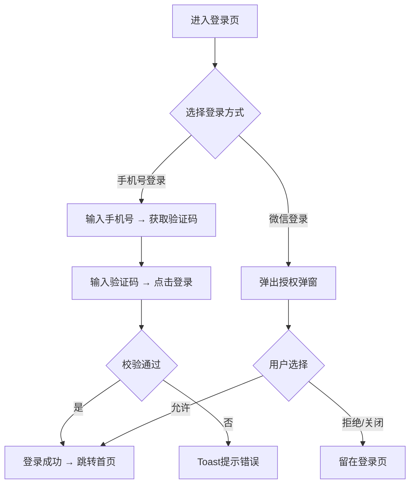

# 页面章节模板 V5.0

## 核心原则

1. **先讲故事，再列数据** — 用自然语言描述页面目的和用户场景，让读者先建立整体认知
2. **一张表说清一个字段** — 字段名称、类型、校验规则、错误提示合并到一张表，不拆分
3. **不重复** — 同一条规则只出现一次，不在多个表格中反复罗列
4. **不适用的章节直接省略** — 不留空占位

---

## 模板结构

所有页面内小节标题必须带编号，格式为 `{页面编号}.{序号}`：

```
### {X}.{Y} {页面名称}（{filename}）

#### {X}.{Y}.1 功能概述
（叙述体，2-4句话。按需生成，纯展示页可省略）

#### {X}.{Y}.2 页面结构
（描述页面由哪些区域/模块组成，配一张元素说明表）

#### {X}.{Y}.3 操作流程
（Mermaid流程图 + 关键步骤的文字说明。有明确操作路径时必须画图，纯展示页可省略）

#### {X}.{Y}.4 字段与交互
（一张合并表：字段名、类型、必填、校验规则、错误提示，全部在一行）

#### {X}.{Y}.5 业务规则
（仅列出非显而易见的规则，不重复字段表中已有的校验）

#### {X}.{Y}.6 页面跳转
（入口来源 + 出口去向，简洁列出）
```

**编号示例：** 若页面为 `### 2.1 手机号登录`，则其小节为 `#### 2.1.1 功能概述`、`#### 2.1.2 页面结构` ... `#### 2.1.6 页面跳转`。

---

## 各章节编写规范

### 1. 功能概述

**格式**：纯叙述体，2-4句话。

**必须回答**：
- 这个页面做什么？
- 谁在什么场景下使用？
- 从哪里进入，用完去哪里？

**示例**：
```
#### 2.1.1 功能概述

登录页是商城的身份认证入口，提供手机号验证码登录和微信授权登录两种方式。用户在未登录状态下点击"我的"Tab时跳转到此页面，登录成功后自动跳转首页。同时提供"立即注册"入口，引导新用户完成注册。
```

**禁止**：使用表格、使用"功能描述/业务描述/使用角色/触发条件"的固定四行格式。

---

### 2. 页面结构

**格式**：先用1-2句话描述整体布局，再用表格列出关键区域。

**示例**：
```
#### 2.1.2 页面结构

页面从上到下分为四个区域：品牌标识区、登录表单区、第三方登录区和底部引导区。

| 区域 | 说明 |
|------|------|
| 品牌标识区 | 渐变背景卡片，展示星形图标、"苏银豆商城"标题和"江苏银行专属积分商城"副标题 |
| 登录表单区 | 手机号输入框 + 验证码输入框（含获取验证码按钮）+ 协议勾选 + 登录按钮 |
| 第三方登录区 | "其他登录方式"分隔线 + 微信登录图标按钮 |
| 底部引导区 | "还没有账号？立即注册"跳转链接 |
```

**注意**：此表格描述的是页面区域（section），不是具体字段。具体字段放在第4节。

---

### 3. 操作流程

**格式**：先放Mermaid流程图，再用文字补充关键判断逻辑。

**规则**：
- 有明确操作流程的页面必须画流程图（参考 flowchart-rules.md）
- 简单页面（如纯展示页）可省略流程图，用文字描述即可
- 文字补充只写流程图中容易遗漏的细节，不要逐节点复述流程图

**示例**：
```
#### 2.1.3 操作流程

用户可使用手机号验证码或微信授权两种方式登录，流程如下：



验证码按钮点击后进入60秒倒计时，期间不可重复获取。微信授权弹窗点击遮罩区域也可关闭。
```

---

### 4. 字段与交互

**格式**：一张合并表格，每行一个字段/交互元素。

**列定义（11列）**：

| 列名 | 说明 |
|------|------|
| 字段名称 | 字段或交互元素的中文名 |
| 字段标识 | snake_case命名 |
| 字段类型 | 输入类型：文本输入/文本域/下拉选择/数字输入/开关/复选框/单选/按钮/日期选择/文件上传等 |
| 必填 | 是/否 |
| 数据类型 | String / Number / Boolean / Date 等 |
| 长度限制 | 最大字符数或数值范围，如"11位"、"6位"、"1-30" |
| 默认值 | 页面加载时的初始值，如"默认勾选"、"空" |
| 校验规则 | 具体校验逻辑，如"11位纯数字"、"非空"、"手机号格式" |
| 取值范围 | 可选值枚举，如"0-9"、"true/false" |
| 来源 | 数据来自哪里：用户输入/系统生成/外部接口/本地缓存 |
| 错误提示 | 校验不通过时的提示文案，多种场景用分号分隔 |

**核心原则**：一个字段的所有信息在一行内说清，不需要在其它章节重复。

**示例**：
```
#### 2.1.4 字段与交互

| 字段名称 | 字段标识 | 字段类型 | 必填 | 数据类型 | 长度限制 | 默认值 | 校验规则 | 取值范围 | 来源 | 错误提示 |
|----------|----------|----------|------|----------|----------|--------|----------|----------|------|----------|
| 手机号 | phone_number | 文本输入(tel) | 是 | String | 11位 | 空 | 11位纯数字 | 0-9 | 用户输入 | 为空：请输入手机号；格式错：请输入正确的手机号 |
| 验证码 | verify_code | 文本输入 | 是 | String | 6位 | 空 | 6位数字，非空 | 0-9 | 用户输入 | 请输入验证码 |
| 获取验证码 | send_code | 按钮 | - | - | - | "获取验证码" | 先校验手机号格式，通过后进入60s倒计时 | - | - | 手机号格式错：请输入正确的手机号 |
| 协议勾选 | agreement | 复选框 | 是 | Boolean | - | 勾选 | 必须为true | true/false | 用户操作 | 请同意用户协议和隐私政策 |
| 登录 | login_btn | 按钮 | - | - | - | - | 按顺序校验手机号→验证码→协议 | - | - | 显示第一个未通过字段的错误提示 |
| 微信登录 | wechat_login | 按钮 | - | - | - | - | 弹出授权弹窗 | - | - | - |
| 拒绝授权 | auth_reject | 按钮 | - | - | - | - | 关闭弹窗 | - | - | 已拒绝授权 |
| 允许授权 | auth_allow | 按钮 | - | - | - | - | 关闭弹窗，模拟登录成功 | - | - | - |
```

---

### 5. 业务规则

**格式**：表格，仅列出不在字段表中、需要额外说明的规则。

**判断标准**：
- 如果规则已在字段表的"规则与说明"列中完整描述，不在此重复
- 此处只放跨字段的、有业务逻辑的、非显而易见的规则

**示例**：
```
#### 2.1.5 业务规则

| 规则编号 | 规则描述 |
|----------|----------|
| RULE-LOGIN-001 | 登录成功后写入本地登录态，后续页面请求携带身份信息 |
| RULE-LOGIN-002 | 微信授权为模拟流程（静态原型阶段），点击"允许"直接模拟登录成功 |
```

**注意**：不再使用"规则名称/适用场景/错误提示"三列，简化为一列编号一列描述。错误提示已在字段表中。

---

### 6. 页面跳转

**格式**：简洁列表，列出所有入口和出口。

**示例**：
```
#### 2.1.6 页面跳转

**入口**：
- 未登录态点击底部Tab"我的"
- 设置页退出登录后跳转
- 注册页点击"已有账号？立即登录"

**出口**：
- 登录成功 → 首页（home_page.html）
- 点击"立即注册" → 注册页（register.html）
- 微信授权成功 → 首页（home_page.html）
```

---

## 按需生成的章节

以下章节仅在确实存在相关内容时才生成，否则直接省略：

| 章节名称 | 生成条件 | 典型页面 |
|----------|----------|----------|
| 状态流转 | 有明确的订单/审核等状态变化 | 订单详情、物流追踪 |
| 数据接口 | 页面有复杂的接口调用或数据来源 | 商品列表（分页加载） |
| 缓存与存储 | 有本地缓存、离线数据需求 | 购物车（本地存储） |

**禁止**：生成空表格或"不适用"占位。
