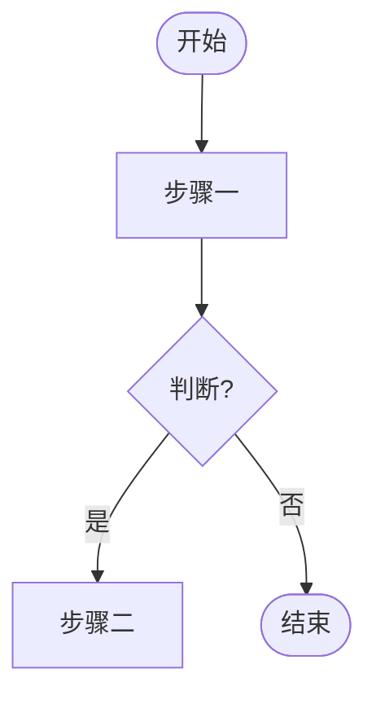
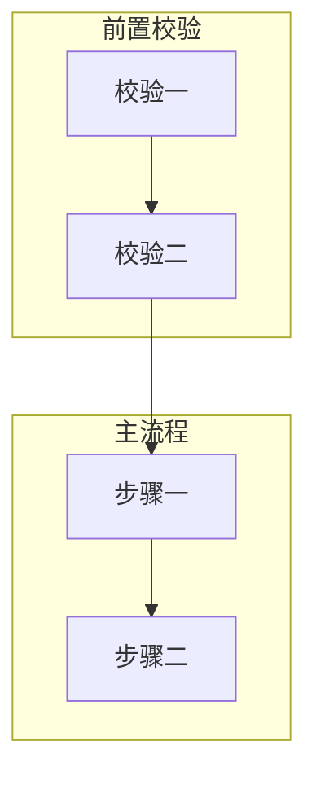
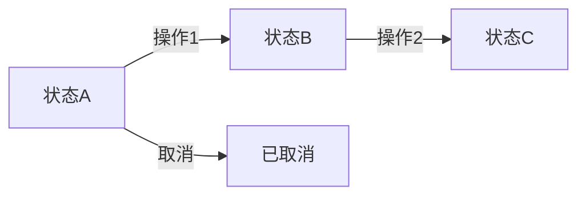
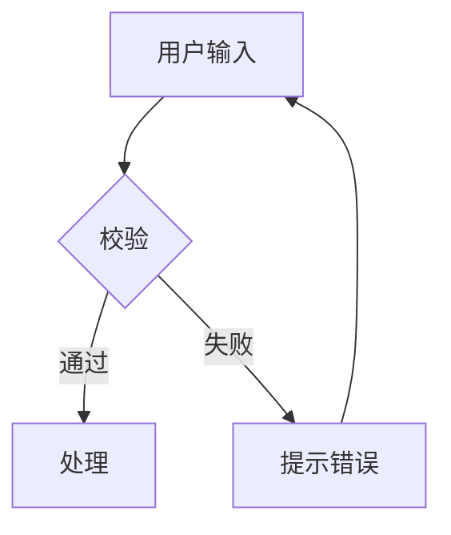

# 流程图生成规则 V0.13

定义业务流程图生成规范。优先 `/diagram-design`，不可用回退 Mermaid。

**V0.13 变更**：精简渲染排错细节，聚焦核心规范（节点/连接/文案/模板）。

---

## 渲染优先级

| 优先级 | 方案 | 适用条件 |
|--------|------|----------|
| 1 | **`/diagram-design` 技能** | 技能已安装（`~/.claude/skills/diagram-design/` 存在） |
| 2 | **Mermaid 代码块** | diagram-design 不可用时回退 |

回退 Mermaid 时，首次提示用户一次：安装 diagram-design 可获更高质量 HTML 流程图。

---

## 适用场景

| 场景 | 图类型 |
|------|--------|
| 完整业务流程（下单/审批/流转） | 全流程图 |
| 状态机（订单/审核状态） | 状态流转图 |
| 复杂页面交互（多步表单/弹窗链） | 交互流程图 |
| 跨页面校验逻辑 | 校验子图 |

---

## 方案1：diagram-design（首选）

调用 `Skill` 工具，参数：diagram type（flowchart/state-machine）、输入（按本规则节点结构）、输出路径 `PRD/diagrams/{流程名}.html`。

**节点形状映射**：

| 节点类型 | 形状 |
|----------|------|
| 开始/结束 | Oval (`rx=20`) |
| 普通步骤 | Rectangle (`rx=6`) |
| 判断/分支 | Diamond（≤3 出口，超过则嵌套） |
| 合并点 | Small filled dot (`r=4`) |

**颜色约定**（与 diagram-design 设计系统对齐）：

| 状态 | 语义 |
|------|------|
| 成功/完成 | accent + accent-tint（≤2 焦点节点） |
| 失败/错误 | ink @ 0.05 + muted stroke（低权重） |
| 警告/阻断 | ink @ 0.02 + ink @ 0.20 dashed |
| 中间态 | white + ink stroke |

**文档引用**（即使 diagram-design 生成 HTML，仍需 `<details>` 保留 Mermaid 源码备份）：

```markdown


<details><summary>Mermaid 源码（备选）</summary>


</details>
```

---

## 方案2：Mermaid（备选）

### 基本语法



### 节点与连接

| 节点语法 | 形状 | | 连接语法 | 样式 |
|---------|------|-|---------|------|
| `([文本])` | 圆角矩形 | | `-->` | 主流程实线 |
| `[文本]` | 矩形 | | `-.->` | 可选/异常虚线 |
| `{文本}` | 菱形 | | `==>` | 关键路径加粗 |

### 子图组织



子图用中文命名（前置校验/输入处理/主流程/结果处理/异常处理）。

### Mermaid → SVG 渲染

| 优先级 | 方案 | 适用 |
|--------|------|------|
| 1 | `mmdc -i input.mmd -o output.svg` | 本机已装 mmdc |
| 2 | kroki.io POST | 有网络，≤100 行 |
| 3 | mermaid.ink GET | 有网络，≤80 行无中文 |
| 4 | 留 `.mmd` 源文件 + 空占位 | 全部失败 |

源文件管理：`.mmd` 与 SVG 同目录，纳入版本控制。

---

## 文案规范

- **节点文案**：2-8 字，动宾结构（校验库存、锁定库存）；判断节点用问句（支付成功?）
- **连线标签**：简短条件（是/否、成功/失败），用 `-->|标签|`；同一判断的分支标签对应

---

## 常见流程模板





---

## 生成原则

1. 流程图必须在源码有对应实现，不臆测
2. 分支完整 — 判断节点覆盖所有分支
3. 命名统一 — 节点与源码变量/函数命名一致
4. 层次清晰 — 子图分隔阶段
5. 优先 diagram-design，Mermaid 仅备选
6. diagram-design 生成后仍保留 Mermaid 源码备份

---

## 常见错误

| 错误 | 正确做法 |
|------|----------|
| 节点文案过长 | 2-8 字，动宾结构 |
| 判断节点无问号 | 用问句结尾 |
| 所有节点同色 | 成功/失败用约定颜色 |
| 分支不完整 | 覆盖所有判断分支 |
| 虚线表示主流程 | 虚线仅用于可选/异常 |
| diagram-design 可用却用 Mermaid | 优先 diagram-design |
| 生成后不留 Mermaid 备份 | `<details>` 保留源码 |
