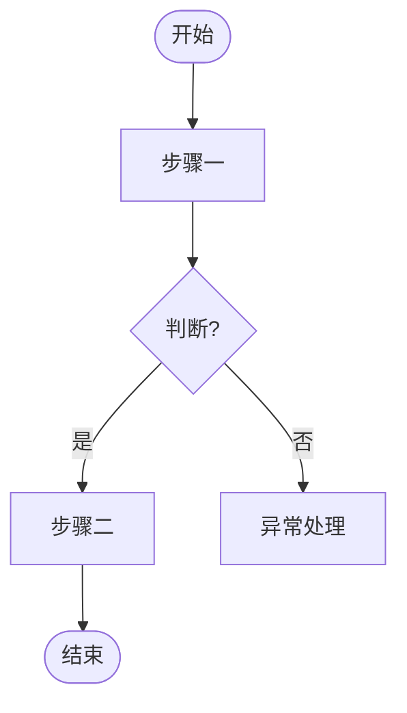
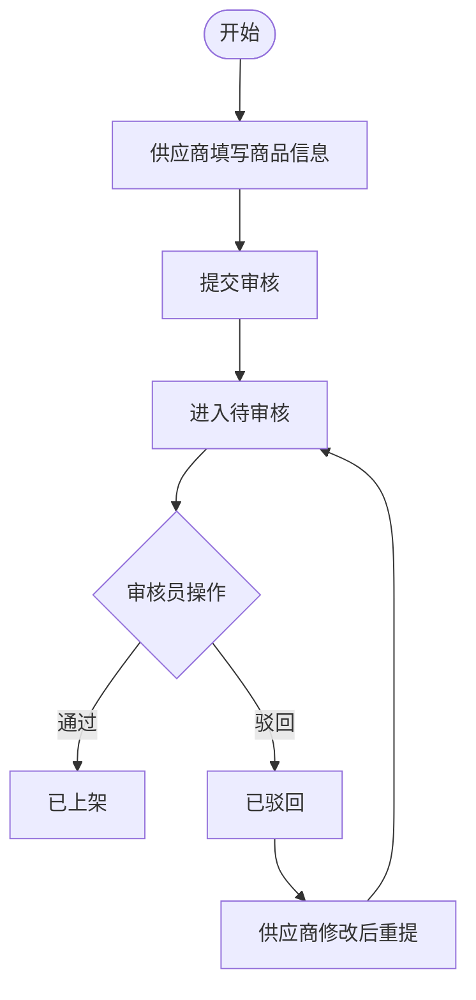

# 模块章节模板 V1.0

定义单个模块的 **3 段结构**。整篇 PRD 的骨架见 `version-prd.md`。

**3 段**：
1. 二.{代号}.2 功能用例与验收
2. 三.{代号} 核心流程
3. 四.{代号} 数据流向

---

## 核心原则

1. **先讲故事再列数据** — 每段开头 1-2 句概括，再上表/图
2. **一行说清一个字段** — 字段所有信息压在一行，不在别处重复
3. **UC↔AC 强绑定** — 每条验收可追溯到具体用例（对应用例列）
4. **按需生成** — 不适用子节直接省略，不留空占位

---

## 模板结构

```
## 二.{代号}.2 功能用例与验收
  ### 功能用例表      ← UC-{代号}-{n}
  ### 验收标准        ← AC-{代号}-{n} + 对应用例列
  #### 测试账号        ← 全文仅出现一次（首个模块）

## 三.{代号} 核心流程
  ### 3.{代号}.1 主流程      ← Mermaid 流程图 + 文字补充
  ### 3.{代号}.2 状态流转     ← 含守卫条件
  ### 3.{代号}.3 异常与边界   ← 功能异常 + 非功能（并发幂等/一致性）

## 四.{代号} 数据流向
  ← 开头 1-2 句叙述：数据从哪来→经谁处理→到哪去
  ### 4.{代号}.1 数据责任      ← 角色×动作（中文动词：创建/查看/修改/删除）
  ### 4.{代号}.2 字段说明      ← 9 列，首列字段中文名，含统计口径指标
```

---

## 第一段：功能用例与验收

### 功能用例表

| 编号 | 角色 | 场景 | 动作 | 预期结果 |
|------|------|------|------|----------|
| UC-{代号}-01 | {角色代号} | {2-6字场景} | {动词开头的操作} | {具体到状态/文案/跳转} |
| UC-{代号}-02 | | | | |

> 一条用例 = 一个完整的角色交互单元。动作要包含元素或按钮文案（用引号）。

### 验收标准

| 编号 | 对应用例 | Given | When | Then |
|------|:--------:|-------|------|------|
| AC-{代号}-01 | UC-{代号}-01 | {前置状态/数据} | {触发动作} | {可测试的结果} |
| AC-{代号}-02 | UC-{代号}-01 | {异常前置} | {动作} | {异常处理} |

> **对应用例列**建立 UC↔AC 链接。一条用例可对应多条验收（正常+异常），每条验收必须可追溯到某条用例。

#### 测试账号  `（全文仅一次，仅首个模块输出）`

| 手机号 | 姓名 | 角色 | 状态 | 用途 |
|--------|------|------|------|------|
| {phone} | {name} | {代号} | 正常 | {该账号用于测什么} |

验证码：{规则或固定值}
重置：浏览器控制台执行 `Auth.resetAccounts()` 恢复初始数据

> 其余模块此处写：`> 测试账号见「二.{首个代号}.2 测试账号」`

---

## 第二段：核心流程

### 3.{代号}.1 主流程

> 图示优先，文字仅补充图中无法表达的内容。



**文字补充**（仅写图里容易遗漏的细节，如倒计时、防抖、遮罩关闭等）：

- ...

> 流程图规范详见 `rules/flowchart-rules.md`。优先 diagram-design，不可用回退 Mermaid。

### 3.{代号}.2 状态流转

| 对象 | 状态1 | → 状态2 | 触发条件 | 触发角色 | 守卫条件 |
|------|-------|---------|----------|----------|----------|
| {对象} | 草稿 | 待审核 | 供应商提交 | SP | 必填项齐全 |
| {对象} | 待审核 | 已上架 | 审核员通过 | RV | 内容未被他人修改 |

> 「守卫条件」= 状态跳转前必须满足的额外校验（相对重量版新增列，避免遗漏并发/前置校验）。

### 3.{代号}.3 异常与边界

**功能异常**：

| 异常场景 | 触发条件 | 处理方式 |
|----------|----------|----------|
| SKU 规格值重复 | 同一 SPU 下两个 SKU 选了相同规格组合 | 提交时校验，提示「规格值重复」 |

**非功能**（并发幂等/数据一致性，按需）：

| 边界类型 | 场景 | 处理策略 |
|----------|------|----------|
| 并发 | 审核中商品被供应商修改重提 | 审核员视图加「内容已更新」标记 |
| 幂等 | 重复提交订单 | 按钮禁用 + 后端幂等键 |
| 一致性 | 库存与订单 | 下单预扣 + 支付兜底校验 |

> 重量版的独立「非功能需求」章节已并入此处。简单模块可省略非功能表。

---

## 第三段：数据流向

> 先用 1-2 句话讲清数据怎么流，再上表。例：「商品信息由供应商创建维护，审核员把关审核状态，运营仅查看；销量/好评率由订单和评价数据实时计算。」

### 4.{代号}.1 数据责任

> 谁能对业务数据做什么，用**中文动词**（创建/查看/修改/删除）。列头用角色代号。

| 业务数据 | {代号} | {代号} | {代号} |
|----------|--------|--------|--------|
| 商品信息 | 查看 | 创建/修改/删除 | 查看/修改 |
| 审核记录 | 查看 | — | 创建/查看 |

### 4.{代号}.2 字段说明（9 列）

> 仅列新增/变更字段。**首列「字段中文名」面向业务/测试**，次列「字段名」(snake_case) 面向开发对接。**统计类指标作为特殊字段行**，「来源」列填计算公式。

| 字段中文名 | 字段名 | 类型 | 校验规则 | 取值范围 | 来源 | 去向 | 错误提示 | 说明 |
|-----------|--------|------|----------|----------|------|------|----------|------|
| {中文名} | {name} | {type} | {规则} | {枚举/范围} | {来源} | {去向} | {文案} | {备注} |

**列定义**：

| 列 | 规则 |
|----|------|
| 字段中文名 | 面向业务/测试的中文名，必填 |
| 字段名 | snake_case 标识，面向开发对接 |
| 类型 | string/number/boolean/enum/date |
| 校验规则 | 非空/格式/长度等，无则填 — |
| 取值范围 | 枚举值或数值区间，无则填 — |
| 来源 | 用户输入/系统生成/外部接口/上一页传入；**统计指标填计算公式** |
| 去向 | 写入的表/接口/页面，或「仅展示」 |
| 错误提示 | 校验失败文案，多种用分号；无则填 — |
| 说明 | 补充备注，如「销量统计口径」 |

---

## 填写示例（模块：商品管理，代号 P，角色 SP/RV）

### 二.P.2 功能用例与验收

**功能用例表**

| 编号 | 角色 | 场景 | 动作 | 预期结果 |
|------|------|------|------|----------|
| UC-P-01 | SP | 新增实物商品 | 填写 SPU 信息 + SKU 规格 → 提交 | 商品进入待审核状态 |
| UC-P-02 | RV | 审核商品 | 查看详情 → 点击「审核通过」 | 商品状态变为已上架 |
| UC-P-03 | RV | 驳回商品 | 查看详情 → 填写驳回原因 → 提交 | 状态变为已驳回，供应商可见原因 |

**验收标准**

| 编号 | 对应用例 | Given | When | Then |
|------|:------:|-------|------|------|
| AC-P-01 | UC-P-01 | 供应商已登录，在商品管理页 | 点击「新增商品」，填写必填项并提交 | 列表出现新商品，状态「待审核」 |
| AC-P-02 | UC-P-01 | 供应商未填写 SPU 名称 | 点击提交 | 提示「请填写商品名称」，无法提交 |
| AC-P-03 | UC-P-02 | 审核员在待审核列表，存在待审商品 | 进入详情，点击「审核通过」 | 状态变为「已上架」，前台可搜索到 |

**测试账号**

| 手机号 | 姓名 | 角色 | 状态 | 用途 |
|--------|------|------|------|------|
| 13800000001 | 供应商甲 | SP | 正常 | 新增/修改商品 |
| 13800000002 | 审核员乙 | RV | 正常 | 审核商品 |

验证码：123456（开发期固定）
重置：浏览器控制台执行 `Auth.resetAccounts()`

### 三.P 核心流程

#### 3.P.1 主流程



#### 3.P.2 状态流转

| 对象 | 状态1 | → 状态2 | 触发条件 | 触发角色 | 守卫条件 |
|------|-------|---------|----------|----------|----------|
| 商品 | 草稿 | 待审核 | 供应商提交 | SP | 必填项齐全 |
| 商品 | 待审核 | 已上架 | 审核员通过 | RV | 审核期间内容未被修改 |
| 商品 | 待审核 | 已驳回 | 审核员驳回 | RV | 必填驳回原因 |
| 商品 | 已驳回 | 待审核 | 供应商修改后重提 | SP | 修改了被驳回字段 |

#### 3.P.3 异常与边界

**功能异常**：

| 异常场景 | 触发条件 | 处理方式 |
|----------|----------|----------|
| SKU 规格值重复 | 同一 SPU 下两个 SKU 选了相同规格组合 | 提交时校验，提示「规格值重复」 |

**非功能**：

| 边界类型 | 场景 | 处理策略 |
|----------|------|----------|
| 并发 | 审核时商品被供应商修改重提 | 审核员视图加「内容已更新」标记，需重新确认 |

### 四.P 数据流向

商品信息由供应商创建和维护，审核员在审核时可查看和修改审核相关字段，运营人员仅查看；销量、好评率、折扣由订单和评价数据实时计算。

#### 4.P.1 数据责任

| 业务数据 | OP(运营) | SP(供应商) | RV(审核员) |
|---------|----------|-----------|-----------|
| 商品 SPU/SKU | 查看 | 创建/修改/删除 | 查看/修改 |
| 审核记录 | 查看 | — | 创建/查看 |

#### 4.P.2 字段说明

| 字段中文名 | 字段名 | 类型 | 校验规则 | 取值范围 | 来源 | 去向 | 错误提示 | 说明 |
|-----------|--------|------|----------|----------|------|------|----------|------|
| 商品名称 | spu_name | string | 非空，≤30字 | — | 供应商输入 | 列表/详情/审核页/前台 | 请填写商品名称 | 商品主名称 |
| 审核状态 | audit_status | enum | — | draft/pending/online/rejected | 审核员操作 | 列表状态列/状态流转 | — | 审核状态 |
| 销量 | sales_volume | number | — | ≥0 | SKU 已完成订单件数求和 | 商品列表/详情 | — | 销量统计口径 |
| 好评率 | favor_rate | number | — | 0-100% | 五星好评数÷全部评价数×100% | 商品详情 | — | 好评率口径，保留一位小数 |
| 折扣 | discount | number | — | 0-10 | 现价÷原价×10 | 商品详情/列表角标 | — | 折扣口径，保留一位小数 |

---

## 填写示例 2：会话管理（代号 S，实时通信场景）

> 基于 CS 客服系统 `customer_chat_sessions` 表。展示实时通信场景与 CRUD 场景（示例 1）的差异：状态机更复杂、数据口径为衍生指标、WebSocket 推送单列「实时通信」章节。

### 二.S.2 功能用例与验收

| 编号 | 角色 | 场景 | 动作 | 预期结果 |
|------|------|------|------|----------|
| UC-S-01 | U | 发起咨询 | 建立连接 | 状态 `wait`，进等待队列 |
| UC-S-02 | A | 接入会话 | 点等待列表用户 | `wait→accept`，写 admin_id/accepted_at |
| UC-S-03 | A | 关闭会话 | 点「关闭」 | `accept→close` |
| UC-S-04 | U | 取消等待 | 等待中离开 | `wait→cancel`，写 canceled_at |

| 编号 | 对应用例 | Given | When | Then |
|------|:------:|-------|------|------|
| AC-S-01 | UC-S-01 | 用户已登录无活跃会话 | 建立连接 | 状态 wait，客服端 waiting-users 推送 |
| AC-S-02 | UC-S-02 | 该会话已被另一客服接入 | 客服点接入 | 提示「会话已被接入」，不重复分配 |

### 三.S 核心流程

状态流转（守卫条件是实时场景关键）：

| 对象 | 状态1 | → 状态2 | 触发条件 | 触发角色 | 守卫条件 |
|------|-------|---------|----------|----------|----------|
| 会话 | wait | accept | 客服接入 | A | 会话未被他人接入 |
| 会话 | wait | cancel | 用户离开 | U | 仍为 wait |
| 会话 | wait | broken | 全员离线/超时 | SYS | 触发 u-offline 规则 |

异常与边界（非功能为重点）：

| 类型 | 场景 | 处理策略 |
|------|------|----------|
| 并发 | 多客服抢同一 wait 会话 | 原子更新 admin_id |
| 幂等 | 重复 cancel/close | 终态校验忽略 |

### 四.S 数据流向

会话由用户发起咨询时创建，客服接入后维护，系统在超时或全员离线时自动中断；响应时长与满意度由系统从时间戳和评价数据实时计算。

#### 4.S.1 数据责任

| 业务数据 | U(用户) | A(客服) | SYS(系统) |
|---------|---------|---------|-----------|
| 会话信息 | 发起 | 接入/关闭/转接 | 超时中断 |

#### 4.S.2 字段说明

| 字段中文名 | 字段名 | 类型 | 校验规则 | 取值范围 | 来源 | 去向 | 错误提示 | 说明 |
|-----------|--------|------|----------|----------|------|------|----------|------|
| 接入客服 | admin_id | uint | — | — | 客服接入时写入 | 列表筛选 | — | wait 时为空 |
| 发起时间 | queried_at | datetime | — | — | 会话创建 | 响应时长统计 | — | 用户咨询时间 |
| 接入时间 | accepted_at | datetime | — | — | 接入时写入 | 响应时长统计 | — | 客服响应时间 |
| 平均响应时长 | avg_response_sec | number | — | ≥0 | avg(accepted_at−queried_at) | 仪表盘 | — | 平均响应时长口径 |
| 满意度 | satisfaction | number | — | 0-100% | rate≥4 会话数÷已评价会话数 | 仪表盘 | — | 满意度口径 |

> WebSocket 推送协议（send-message / receive-message / user-transfer / waiting-users 等 Action）见「实时通信」章节，不在模块 3 段内重复。

---

## Anti-patterns

| 反模式 | 正确做法 |
|--------|----------|
| 验收标准不填「对应用例」列 | 每条 AC 必须绑定到某条 UC |
| 统计指标单列一节 | 作为字段行写入字段说明表，来源列填公式 |
| 测试账号每个模块都写一遍 | 全文仅首个模块输出一次，其余引用 |
| 字段校验规则在流程、字段表、异常表重复写 | 只写在字段表的「校验规则」列 |
| 状态流转无守卫条件 | 补「守卫条件」列，标明跳转前的额外校验 |
| 异常边界只写功能异常 | 重要模块补非功能（并发/幂等/一致性） |
| 简单模块硬凑满 3 段所有子节 | 按需省略，不留空占位 |
| Mermaid 流程图节点文案过长 | 2-8 字，动宾结构，判断节点用问句 |
